# Day 8

Deploy previous project on EC2 (AWS) or Heroku.

Base url : https://agmc-irvanahmadp.herokuapp.com/

## Images

### Auth

https://agmc-irvanahmadp.herokuapp.com/auth/

Login
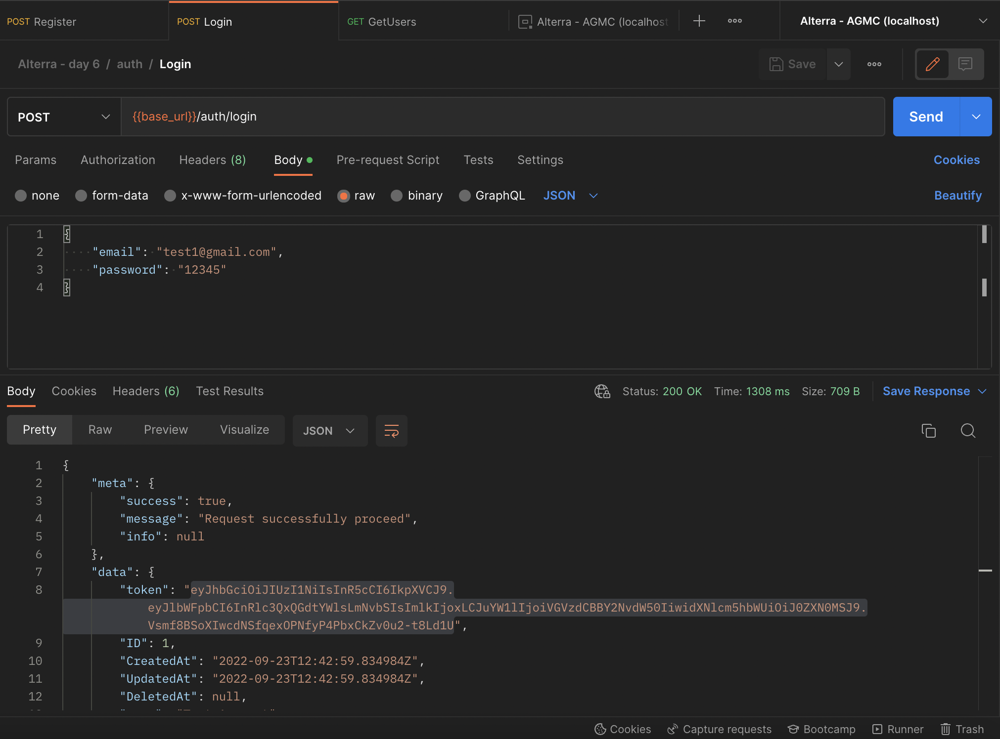

Register
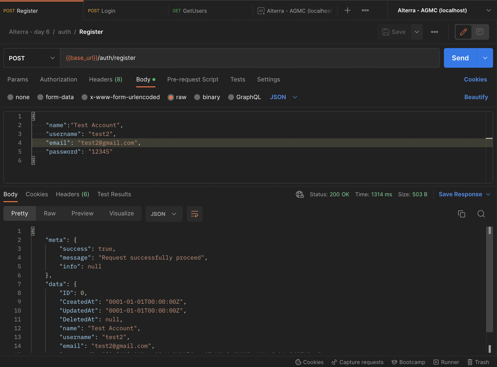

## Book

https://agmc-irvanahmadp.herokuapp.com/books/

Create Book
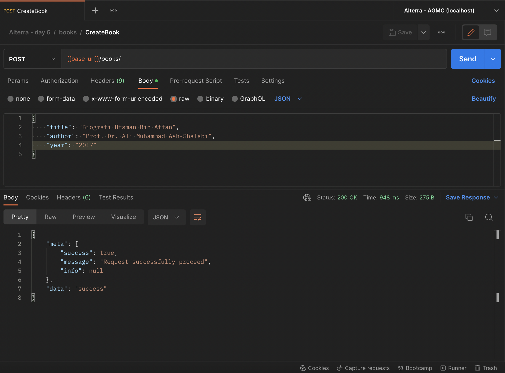

Get Books
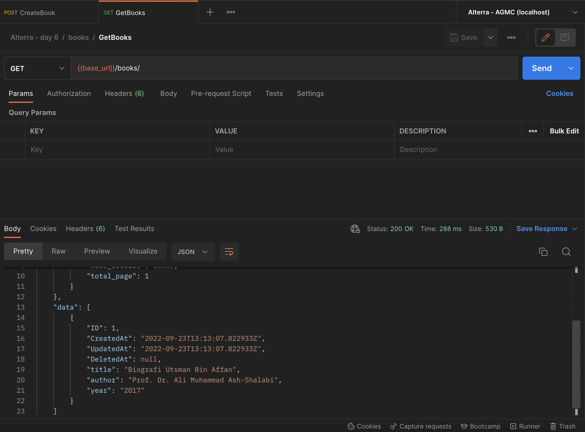

Get Book By ID
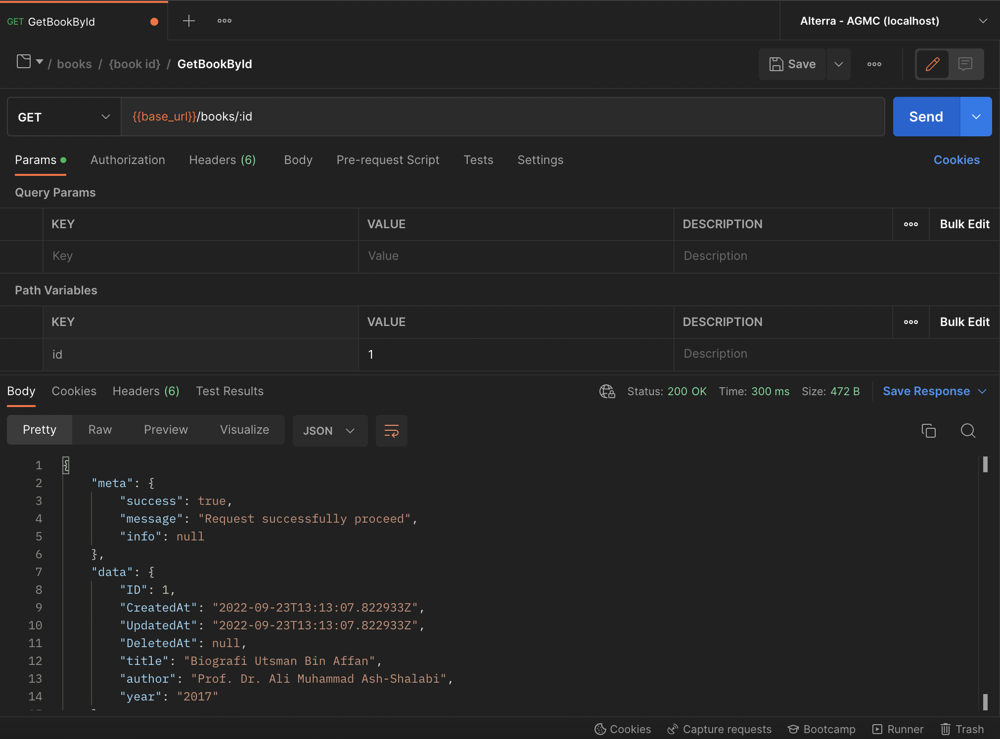

Update Book By ID
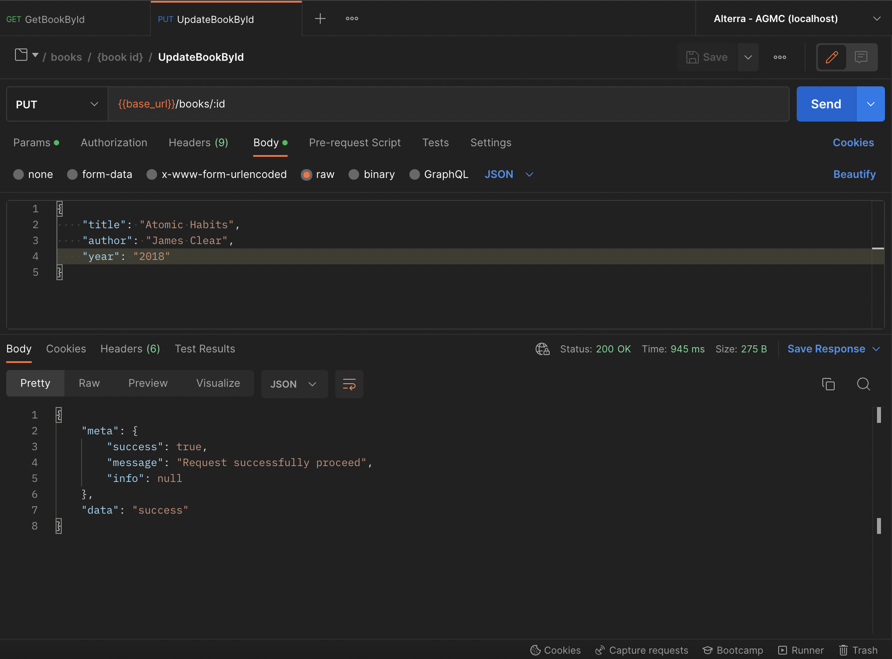

Delete Book By ID
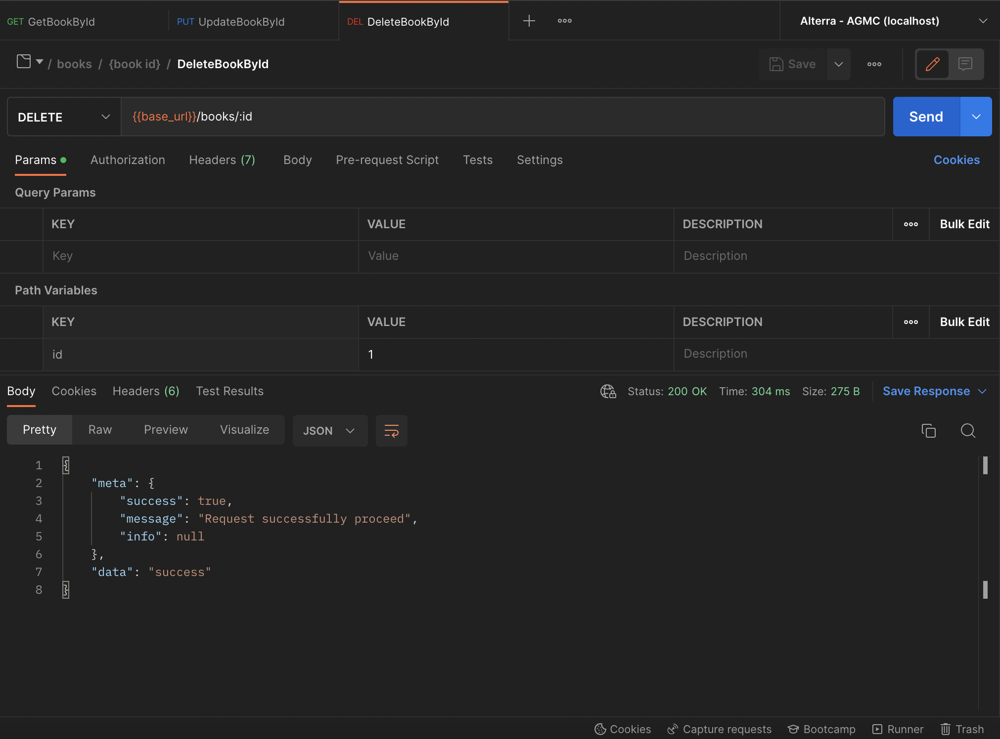

## User

https://agmc-irvanahmadp.herokuapp.com/users/

Get Users
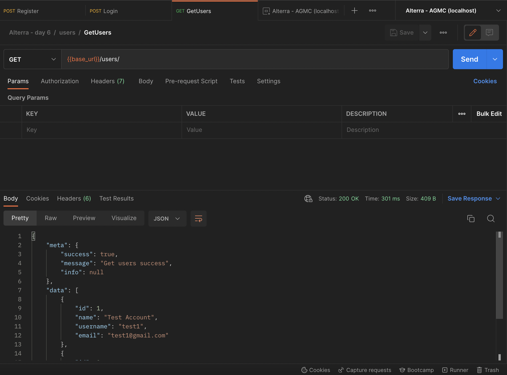

Get User By ID
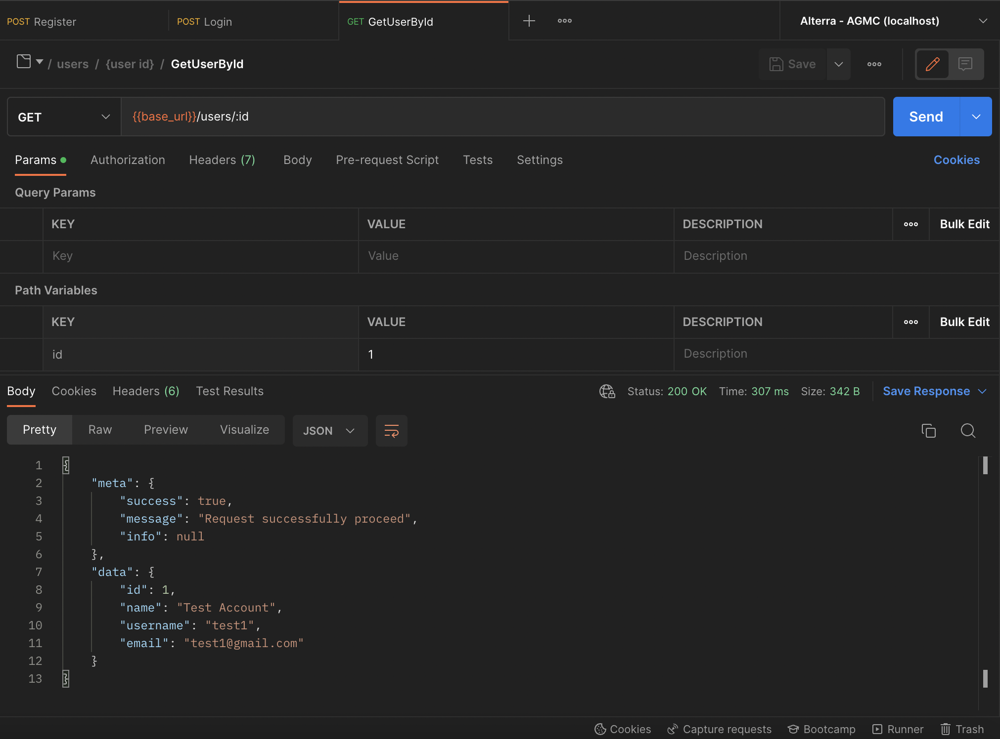

Update User By ID
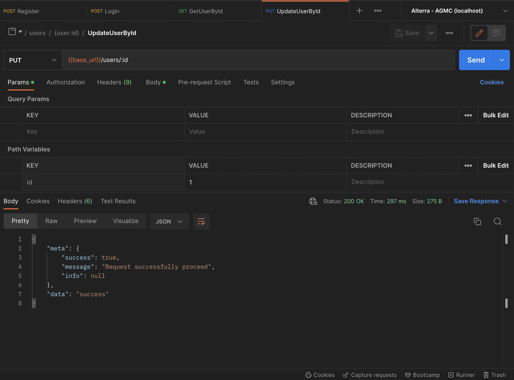

Delete User By ID
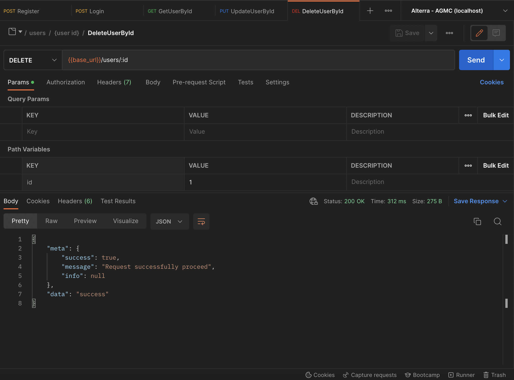
